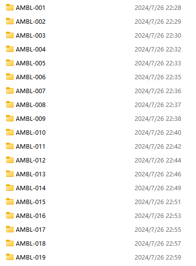
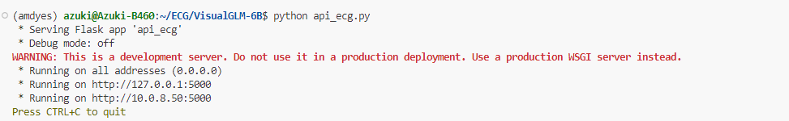
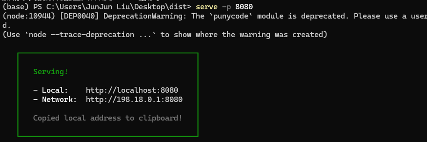
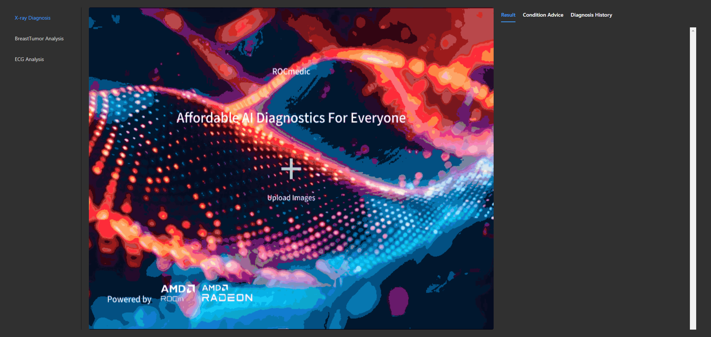
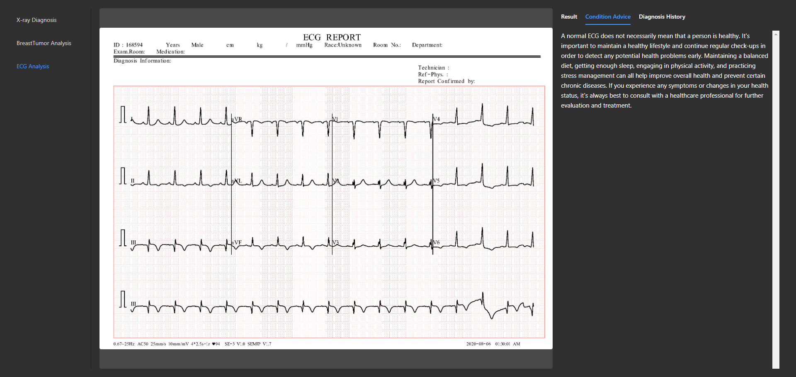
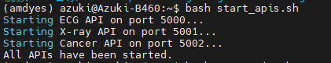

## Reproduction Instructions

**Introduction:**
The following section provides detailed instructions for reproducing the data processing workflows used in ROCmedic. This includes steps for handling breast cancer, ECG, and X-ray imaging data, ensuring the data is in a suitable format for model training and fine-tuning.

### 1.1 Data Processing

**1.1.1 Breast Tumor Data**

1. **Data Acquisition**
   - Download the relevant data from the Cancer Imaging Archive website, which offers data downloaders for both Linux and Windows platforms.
   - Save the downloaded data onto your server or local machine. The data should appear as shown in the example below.



1. **Data Processing**

   - Navigate to the specified directory using the command:

     ```bash
     cd Biochemical
     ```

   - Execute the following commands sequentially to process the data:

     ```bash
     python dataprocessing.py   # This step may take a considerable amount of time.
     python find_emptyimages.py
     python convert_json.py
     python json_normalization.py
     python add_suggestion.py
     ```

   - These scripts will convert DICOM files into trainable image formats, add labels and prompts, and include diagnostic suggestions. The final output will be JSON files ready for model fine-tuning.

   - Note: Due to the large volume of data (646GB), full-scale data training was not feasible on our server. Users with sufficient hardware resources are recommended to perform full data fine-tuning to achieve optimal model performance.

**1.1.2 ECG Data**

**Data Preparation**

- Navigate to the ECG data directory:

  ```bash
  cd ECG
  ```

- Execute the following commands to process the ECG data:

  ```bash
  python dataprocessing.py
  python add_suggestions_to_json.py
  ```

- These scripts will handle the data processing, transforming it into a format suitable for model training.

**1.1.3 X-ray Data**

**Data Handling**

- The X-ray data has been pre-processed and does not require additional steps.
- However, for those interested in the processing logic, reference the code within the Xray/data directory, which contains comprehensive data handling procedures.

### 1.2 Reproduction Process

This section outlines the steps required to reproduce and test the individual components of ROCmedic. It includes detailed instructions for debugging and running the application, ensuring that users can effectively replicate the processes for ECG, X-ray, and Breast Tumor analysis.

**1.2.1 Individual Debugging**

For debugging individual components, follow the steps below. Here, ECG analysis is used as an example.

1. **Navigate to the ECG Directory:**

   ```bash
   cd ECG/VisualGLM-6B
   ```

2. **Start the Backend Service:**
   Run the following command to initiate the backend service:

    ```bash
   python api_ecg.py
    ```

    Upon successful initiation, the backend service should display output indicating it is running on various addresses.

    

3. **Start the Frontend Service:**
   In the frontend directory, start the service using:

    ```bash
   serve -p 8080
    ```

    If `serve` is not installed, run `npm install serve` first. Upon successful start, the terminal should display the service running at local and network addresses.

    

4. **Access the Service in a Browser:**
   Open the specified local address (e.g., [http://localhost:8080](http://localhost:8080/)) in a web browser. Navigate to the ECG Analysis tab, upload an image, and view the returned results.

    

    

    The steps for debugging X-ray Diagnosis and Breast Tumor Analysis are similar. Ensure you select the appropriate project in the frontend during testing.

### 1.2.2 Full System Testing

1. **Start All APIs:**
   To initiate all services simultaneously, execute the following script:

    ```bash
   bash start_apis.sh
    ```

    Upon successful initiation, you should see a confirmation message indicating that all services are running.

    

2. **Access and Use the Services:**
   Open the web interface and interact with the three diagnostic services (ECG, X-ray, and Breast Tumor Analysis). Each service should be accessible and functional, allowing for simultaneous usage.

3. **Stop All APIs:**
   Once testing is complete, stop all running services using:

    ```bash
   bash stop_apis.sh
    ```

    This command will terminate all active services, ensuring that resources are freed.

By following these steps, users can effectively debug and test the individual components as well as the full system of ROCmedic, ensuring that all functionalities are operating as intended.